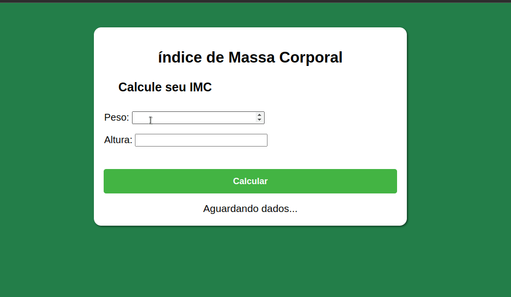

 <h1>Projeto Cálculo de IMC</h1>

Este projeto foi desenvolvido com HTML5, CSS3 e JavaScript para estudos de manipulação do DOM. Neste projeto devem ser inseridos números, referentes ao peso (kg) e a altura (m) respectivamente, para que seja feito o cálculo do IMC.

    

   Confira <a href="https://mendjoy.github.io/projeto_calculo_imc/">aqui</a>

